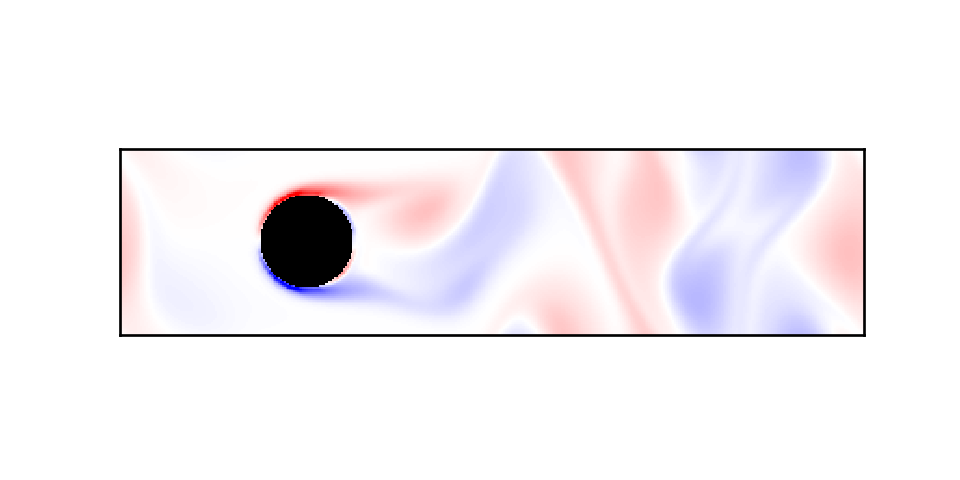

# latticeboltzmann-python
Lattice Boltzmann fluid simulation

## Create Your Own Lattice Boltzmann Simulation (With Python)

### Philip Mocz (2020) Princeton University, [@PMocz](https://twitter.com/PMocz)

### [📝 Read the Algorithm Write-up on Medium](https://medium.com/swlh/create-your-own-lattice-boltzmann-simulation-with-python-8759e8b53b1c)

Simulate a flow past cylinder with the Lattice Boltzmann method


```
python latticeboltzmann.py
```


